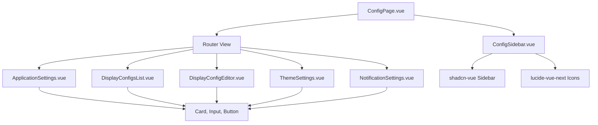

# Config Page Revamp - Implementation Plan

## Overview

This document outlines the implementation plan for **Phase 1** of the Configuration page revamp: setting up the infrastructure with a collapsible sidebar, search functionality, and modular routing structure.

**Scope of This Phase**:

- ✅ Install and configure shadcn-vue Sidebar component
- ✅ Create nested routing structure with lazy loading
- ✅ Implement collapsible sidebar with search
- ✅ Create placeholder config views
- ❌ Individual config view functionality (future phases)

**What This Achieves**: After this phase, you'll have a fully functional navigation structure. The actual configuration functionality (forms, data persistence, etc.) will be implemented in subsequent phases.

## Architecture Decisions

### Routing Strategy: Hybrid Approach

- **Routes**: Flat structure for simplicity (`/config/application-settings`)
- **Files**: Organized by category (`views/general/ApplicationSettings.vue`)
- **Sidebar**: Visual hierarchy with collapsible sections

### Component Library

- **shadcn-vue Sidebar**: Used for the sidebar component
- **Reason**: Built-in collapsibility, theming, composability with existing components

---

## File Structure

```
src/components/Pages/ConfigPage/
├── ConfigPage.vue              # Main layout container
├── ConfigSidebar.vue           # Sidebar with search & collapsible sections
└── views/                      # Individual config view components
    ├── general/
    │   └── ApplicationSettings.vue
    ├── displays/
    │   ├── DisplayConfigsList.vue
    │   └── DisplayConfigEditor.vue
    ├── appearance/
    │   └── ThemeSettings.vue
    └── notifications/
        └── NotificationSettings.vue
```

---

## Implementation Steps

### Phase 1: Setup & Infrastructure

#### Step 1.1: Install shadcn-vue Sidebar Component

```bash
npx shadcn-vue@latest add sidebar
```

**Expected Result**: Sidebar components added to `src/components/ui/sidebar/`

**Verify**:

- [ ] `src/components/ui/sidebar/` folder exists
- [ ] CSS variables added to `src/assets/index.css`
- [ ] All sidebar subcomponents imported successfully

---

#### Step 1.2: Create Directory Structure

Create the following directories and placeholder files:

```bash
# Create directories
mkdir -p src/components/Pages/ConfigPage/views/general
mkdir -p src/components/Pages/ConfigPage/views/displays
mkdir -p src/components/Pages/ConfigPage/views/appearance
mkdir -p src/components/Pages/ConfigPage/views/notifications
```

**Files to Create**:

- `views/general/ApplicationSettings.vue`
- `views/displays/DisplayConfigsList.vue`
- `views/displays/DisplayConfigEditor.vue`
- `views/appearance/ThemeSettings.vue`
- `views/notifications/NotificationSettings.vue`

---

#### Step 1.3: Update Router Configuration

**File**: `src/router/routes.ts`

Add nested routes for config page:

```typescript
{
  path: '/config',
  component: ConfigPage,
  children: [
    {
      path: '',
      redirect: '/config/application-settings'
    },
    {
      path: 'application-settings',
      name: 'config-application-settings',
      component: () => import('@/components/Pages/ConfigPage/views/general/ApplicationSettings.vue'),
      meta: { title: 'Application Settings', category: 'general' }
    },
    {
      path: 'display-configs',
      name: 'config-display-configs',
      component: () => import('@/components/Pages/ConfigPage/views/displays/DisplayConfigsList.vue'),
      meta: { title: 'Display Configurations', category: 'displays' }
    },
    {
      path: 'display-configs/create',
      name: 'config-display-config-create',
      component: () => import('@/components/Pages/ConfigPage/views/displays/DisplayConfigEditor.vue'),
      meta: { title: 'Create Display Config', category: 'displays' }
    },
    {
      path: 'display-configs/:id/edit',
      name: 'config-display-config-edit',
      component: () => import('@/components/Pages/ConfigPage/views/displays/DisplayConfigEditor.vue'),
      meta: { title: 'Edit Display Config', category: 'displays' }
    },
    {
      path: 'theme',
      name: 'config-theme',
      component: () => import('@/components/Pages/ConfigPage/views/appearance/ThemeSettings.vue'),
      meta: { title: 'Theme Settings', category: 'appearance' }
    },
    {
      path: 'notifications',
      name: 'config-notifications',
      component: () => import('@/components/Pages/ConfigPage/views/notifications/NotificationSettings.vue'),
      meta: { title: 'Notification Settings', category: 'notifications' }
    }
  ]
}
```

**Verify**:

- [ ] Routes compile without errors
- [ ] Can navigate to `/config` and get redirected to `/config/application-settings`

---

### Phase 2: Sidebar Implementation

#### Step 2.1: Create ConfigSidebar Component

**File**: `src/components/Pages/ConfigPage/ConfigSidebar.vue`

**Features to Implement**:

1. Collapsible sidebar with shadcn-vue components
2. Search input in header
3. Collapsible sections (General, Displays, Appearance, Notifications)
4. Active route highlighting
5. Filtered navigation based on search

**Key Structure**:

```vue
<template>
  <Sidebar>
    <SidebarHeader>
      <Input v-model="searchQuery" placeholder="Search settings..." />
    </SidebarHeader>
    <SidebarContent>
      <SidebarGroup v-for="section in filteredSections" :key="section.label">
        <Collapsible :default-open="true" class="group/collapsible">
          <SidebarGroupLabel>{{ section.label }}</SidebarGroupLabel>
          <CollapsibleContent>
            <SidebarMenu>
              <SidebarMenuItem v-for="item in section.items" :key="item.path">
                <SidebarMenuButton as-child :is-active="isActive(item.path)">
                  <RouterLink :to="item.path">
                    <component :is="item.icon" />
                    <span>{{ item.title }}</span>
                  </RouterLink>
                </SidebarMenuButton>
              </SidebarMenuItem>
            </SidebarMenu>
          </CollapsibleContent>
        </Collapsible>
      </SidebarGroup>
    </SidebarContent>
    <SidebarFooter>
      <!-- Optional: Add user info or quick actions -->
    </SidebarFooter>
    <SidebarRail />
  </Sidebar>
</template>
```

**Data Structure**:

```typescript
const sidebarSections = [
  {
    label: "General",
    items: [
      {
        title: "Application Settings",
        path: "/config/application-settings",
        icon: Settings,
        keywords: ["app", "title", "general", "redis"],
      },
    ],
  },
  {
    label: "Displays",
    items: [
      {
        title: "Display Configurations",
        path: "/config/display-configs",
        icon: Monitor,
        keywords: ["display", "clock", "config", "layout"],
      },
      {
        title: "Clock Layouts",
        path: "/config/clock-layouts",
        icon: Layout,
        keywords: ["clock", "layout", "rows"],
      },
    ],
  },
  {
    label: "Appearance",
    items: [
      {
        title: "Theme",
        path: "/config/theme",
        icon: Palette,
        keywords: ["theme", "dark", "light", "colors"],
      },
    ],
  },
  {
    label: "Notifications",
    items: [
      {
        title: "Notification Settings",
        path: "/config/notifications",
        icon: Bell,
        keywords: ["notifications", "toast", "alerts"],
      },
    ],
  },
];
```

**Search Logic**:

```typescript
const filteredSections = computed(() => {
  if (!searchQuery.value) return sidebarSections;

  const query = searchQuery.value.toLowerCase();

  return sidebarSections
    .map((section) => ({
      ...section,
      items: section.items.filter(
        (item) => item.title.toLowerCase().includes(query) || item.keywords.some((keyword) => keyword.includes(query))
      ),
    }))
    .filter((section) => section.items.length > 0);
});
```

**Verify**:

- [ ] Sidebar renders with all sections
- [ ] Search filters items correctly
- [ ] Active route is highlighted
- [ ] Clicking items navigates correctly
- [ ] Sections are collapsible

---

#### Step 2.2: Integrate Sidebar with ConfigPage

**File**: `src/components/Pages/ConfigPage/ConfigPage.vue`

**Layout Structure**:

```vue
<template>
  <div class="flex h-screen">
    <SidebarProvider :default-open="true">
      <ConfigSidebar />
      <main class="flex-1 overflow-auto">
        <div class="border-b h-14 flex items-center px-6 gap-4">
          <SidebarTrigger />
          <h1 class="text-2xl font-semibold">{{ currentPageTitle }}</h1>
        </div>
        <div class="p-6">
          <RouterView />
        </div>
      </main>
    </SidebarProvider>
  </div>
</template>

<script setup>
import { computed } from "vue";
import { useRoute } from "vue-router";
import { SidebarProvider, SidebarTrigger } from "@/components/ui/sidebar";
import ConfigSidebar from "./ConfigSidebar.vue";

const route = useRoute();

const currentPageTitle = computed(() => {
  return route.meta.title || "Configuration";
});
</script>
```

**Verify**:

- [ ] Sidebar and content area display side-by-side
- [ ] Sidebar toggle button works
- [ ] Page title updates based on route
- [ ] Content scrolls independently

---

### Phase 3: Create Placeholder Config Views

**Goal**: Create simple placeholder components for each config view. These will be enhanced with full functionality later.

#### Step 3.1: Create All Placeholder Views

Create the following files with the basic placeholder template below:

**Files to Create**:

1. `views/general/ApplicationSettings.vue`
2. `views/displays/DisplayConfigsList.vue`
3. `views/displays/DisplayConfigEditor.vue`
4. `views/appearance/ThemeSettings.vue`
5. `views/notifications/NotificationSettings.vue`

**Placeholder Template** (customize the title for each):

```vue
<template>
  <div class="space-y-6">
    <div>
      <h2 class="text-3xl font-bold">Page Title Here</h2>
      <p class="text-muted-foreground">Page description here</p>
    </div>

    <Card>
      <CardContent class="pt-6">
        <p class="text-muted-foreground">This configuration page will be implemented soon.</p>
      </CardContent>
    </Card>
  </div>
</template>

<script setup>
import { Card, CardContent } from "@/components/ui/card";
</script>
```

**Titles for Each View**:

- **ApplicationSettings.vue**: "Application Settings" / "Configure general application settings"
- **DisplayConfigsList.vue**: "Display Configurations" / "Manage clock display layouts"
- **DisplayConfigEditor.vue**: "Display Configuration Editor" / "Create and edit display configurations"
- **ThemeSettings.vue**: "Theme Settings" / "Customize the application appearance"
- **NotificationSettings.vue**: "Notification Settings" / "Configure notification preferences"

**Verify**:

- [ ] All 5 placeholder files created
- [ ] Each displays its title correctly
- [ ] No import errors
- [ ] Components are accessible via routes

---

### Phase 4: Polish & Verification

#### Step 4.1: Verify Icons (if not already installed)

Check if lucide-vue-next is installed. If not, install it:

```bash
npm install lucide-vue-next
```

**Verify**:

- [ ] Icons display correctly in sidebar
- [ ] No console errors related to icons

---

#### Step 4.2: Test Full Navigation Flow

Test the complete user flow:

1. Navigate to `/config`
2. Verify redirect to `/config/application-settings`
3. Click each sidebar item
4. Verify correct view loads for each route
5. Test browser back/forward buttons
6. Test direct URL navigation

**Verify**:

- [ ] All routes work correctly
- [ ] Page titles update correctly
- [ ] Sidebar highlights active route
- [ ] No console errors during navigation

---

### Phase 5: Testing & Validation

#### Step 5.1: Manual Testing Checklist

**Navigation**:

- [ ] All sidebar items navigate correctly
- [ ] Browser back/forward works
- [ ] Direct URL navigation works
- [ ] Default redirect to `/config/application-settings` works

**Search**:

- [ ] Search filters sidebar items
- [ ] Search is case-insensitive
- [ ] Keywords match correctly
- [ ] Empty search shows all items
- [ ] Filtered sections hide when no matches

**Sidebar**:

- [ ] Sidebar collapses and expands via trigger button
- [ ] Sections collapse and expand individually
- [ ] Active route is highlighted
- [ ] Rail toggle works (if visible)

**Config Views**:

- [ ] All placeholder views render correctly
- [ ] Page titles display properly
- [ ] No console errors when loading views

**Layout & Responsive**:

- [ ] Sidebar and content area display side-by-side
- [ ] Content area scrolls independently
- [ ] Layout adapts to different screen sizes
- [ ] Sidebar is accessible on mobile (collapsible)

---

#### Step 5.2: Edge Cases

Test the following scenarios:

- [ ] Invalid route (e.g., `/config/nonexistent`) - should show 404 or redirect
- [ ] Very long search queries
- [ ] Special characters in search
- [ ] Rapid navigation (fast clicking between routes)
- [ ] Refresh page on a specific config route

---

### Phase 6: Future Enhancements

#### Priority 1: Implement Config View Functionality

These features will be added to individual config views in future iterations:

1. **Application Settings**: App title, timezone, Redis connection settings
2. **Display Configs List**: CRUD operations, table view, search/filter
3. **Display Config Editor**: Visual editor for creating/editing clock layouts
4. **Theme Settings**: Dark/light mode, color customization, animations
5. **Notification Settings**: Toast duration, notification preferences

#### Priority 2: Additional Enhancements

1. **Keyboard Shortcuts**: Navigate sidebar with arrow keys
2. **Recent Items**: Track recently viewed config pages
3. **Favorites**: Star frequently used pages
4. **Export/Import**: Backup and restore configurations
5. **Validation**: Form validation for config inputs
6. **Undo/Redo**: For config editor
7. **Real-time Updates**: WebSocket updates for multi-user scenarios
8. **Permissions**: Role-based access to config sections
9. **Audit Log**: Track who changed what and when
10. **Config Templates**: Pre-built display config templates

---

## Data Flow & State Management

### Local State (Component-level)

- Form inputs
- Search queries
- Loading states
- UI toggle states

### Persistent State (localStorage)

- Application settings (title, timezone)
- Theme preferences
- Notification settings
- Sidebar collapse state

### Server State (Redis)

- ClockDisplayConfig objects
- ClockRowConfig objects
- User preferences (future)

---

## Component Dependencies



---

## Implementation Timeline Estimate

| Phase     | Tasks                    | Estimated Time |
| --------- | ------------------------ | -------------- |
| Phase 1   | Setup & Infrastructure   | 1-2 hours      |
| Phase 2   | Sidebar Implementation   | 2-3 hours      |
| Phase 3   | Placeholder Config Views | 30 minutes     |
| Phase 4   | Polish & Verification    | 30 minutes     |
| Phase 5   | Testing                  | 1 hour         |
| **Total** |                          | **5-7 hours**  |

_Note: Individual config view functionality will be implemented in future phases_

---

## Success Criteria

The implementation will be considered complete when:

1. ✅ All routes navigate correctly with lazy loading
2. ✅ Sidebar renders with collapsible sections
3. ✅ Sidebar search filters items accurately by title and keywords
4. ✅ All placeholder config views render without errors
5. ✅ Active route is highlighted in sidebar
6. ✅ Sidebar collapses/expands via trigger button
7. ✅ Page titles update based on route metadata
8. ✅ No console errors or warnings
9. ✅ Layout is responsive (desktop and mobile)
10. ✅ Manual testing checklist passes

**Future Work** (not in this phase):

- Implement actual functionality for each config view
- Add form validation and data persistence
- Connect to Redis for config storage

---

## Notes & Considerations

### Performance

- Use lazy loading for config views (already in route config)
- Debounce search input (implement if needed)
- Virtualize large lists in DisplayConfigsList (future)

### Accessibility

- Ensure keyboard navigation works
- Add ARIA labels to interactive elements
- Maintain focus management when navigating

### Code Quality

- Use TypeScript types consistently
- Add JSDoc comments for complex logic
- Follow Vue 3 Composition API best practices
- Keep components focused and single-purpose

### Security

- Validate all inputs
- Sanitize data before saving
- Don't expose sensitive Redis connection details

---

## Getting Started

To begin implementation:

1. Review this plan thoroughly
2. Set up a feature branch: `git checkout -b feature/config-page-revamp`
3. Start with Phase 1, Step 1.1
4. Check off items as you complete them
5. Commit frequently with descriptive messages
6. Test each phase before moving to the next

---

_Document created: [Date]_
_Last updated: [Date]_
_Author: [Your Name]_
